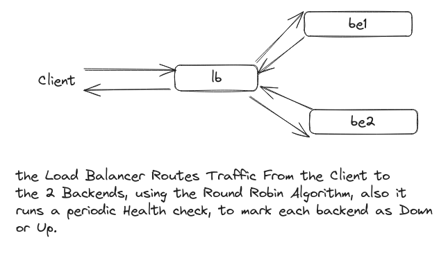

# build-ur-own-load-balencer

This challenge is to build your own application layer load balancer.

A load balancer sits in front of a group of servers and routes client requests across all of the servers that are capable of fulfilling those requests. The intention is to minimise response time and maximise utilisation whilst ensuring that no server is overloaded. If a server goes offline the load balance redirects the traffic to the remaining servers and when a new server is added it automatically starts sending requests to it.

our goals for this project are to:

    Build a load balancer that can send traffic to two or more servers usnig Road Robin Algorithm.
    Health check the servers.
    Handle a server going offline (failing a health check).
    Handle a server coming back online (passing a health check).

to Test, run:

    docker compose up -d

after that make a curl command to:

    http://localshost